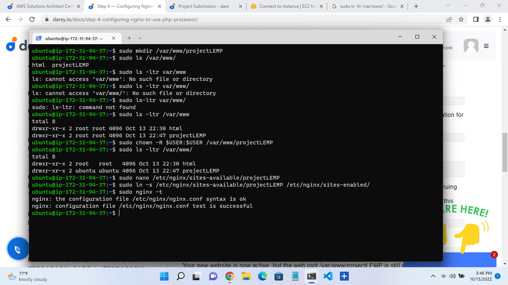
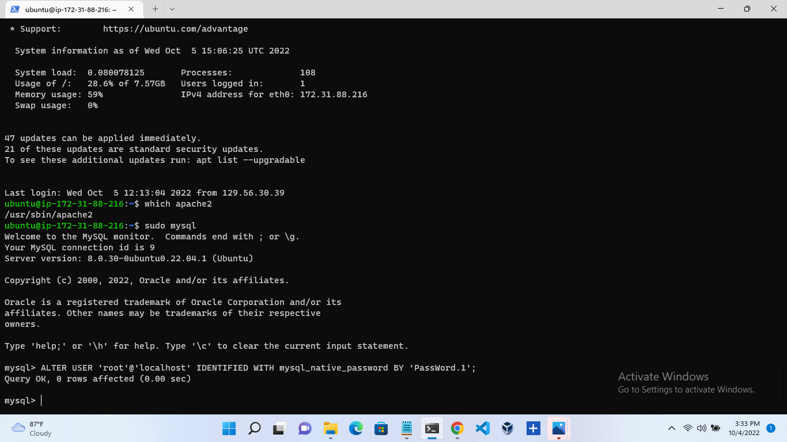
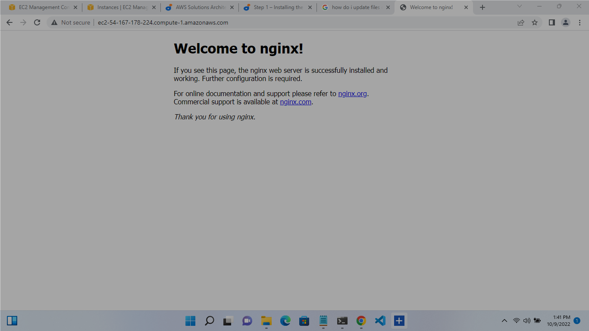
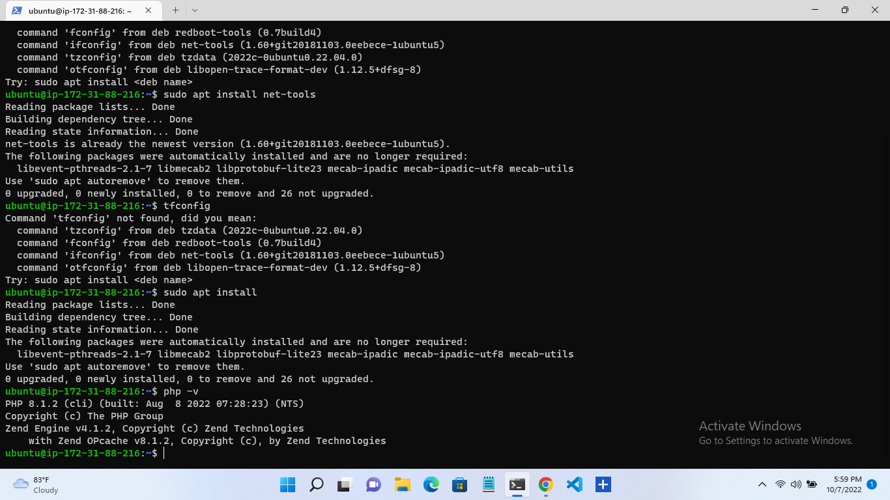
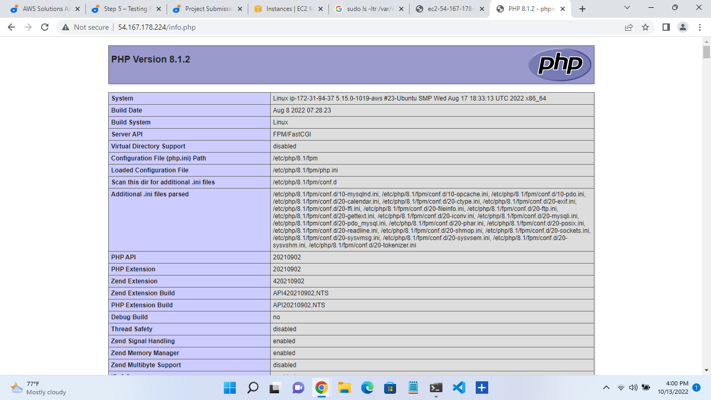

# Awesome Documentation Of project-02
##  – INSTALLING THE NGINX WEB SERVER
 `sudo update `
 
`sudo apt install nginx`

`sudo systemctl status nginx`

`curl http://127.0.0.1:80`

`curl -s http://169.254.169.254/latest/meta-data/public-ipv4`
## INSTALLING MSQL
` sudo apt install mysql-server`

`sudo mysql`

` sudo mysql_secure_installation`

` sudo mysql -p`

`exit `
## INSTALLING PHP
`sudo apt install php-fpm php-mysql ` 
## CONFIGURING NGINX TO USE PHP PROCESSOR
`sudo mkdir /var/www/projectLEMP  `

` sudo nano /etc/nginx/sites-available/projectLEMP `

` sudo ln -s /etc/nginx/sites-available/projectLEMP /etc/nginx/sites-enabled/ `

`sudo nginx -t `

`sudo unlink /etc/nginx/sites-enabled/default `

`sudo systemctl reload nginx `

`http://<Public-IP-Address>:80 `
## TESTING PHP WITH NGINX
` sudo nano /var/www/projectLEMP/info.php`
`<?php
phpinfo(); `
`http://`server_domain_or_IP`/info.php `
## RETRIEVING DATA FROM MYSQL DATABASE WITH PHP (CONTINUED)
`sudo mysql `

`mysql> CREATE DATABASE `example_database`; `

`mysql>  CREATE USER 'example_user'@'%' IDENTIFIED WITH mysql_native_password BY 'password'; `

`mysql> GRANT ALL ON example_database.* TO 'example_user'@'%'; `

`exit `
`mysql -u example_user -p `
`mysql> SHOW DATABASES; `

`mysql> INSERT INTO example_database.todo_list (content) VALUES ("My first important item"); `

`  SELECT * FROM example_database.todo_list; `

`exit `

`nano /var/www/projectLEMP/todo_list.php` 

`http://<Public_domain_or_IP>/todo_list.php  `

c
